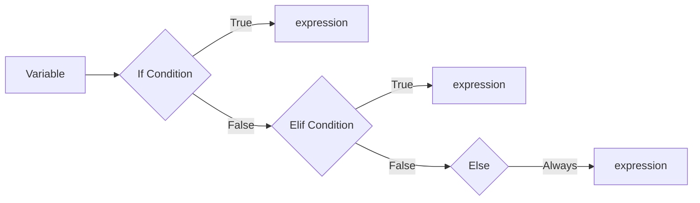
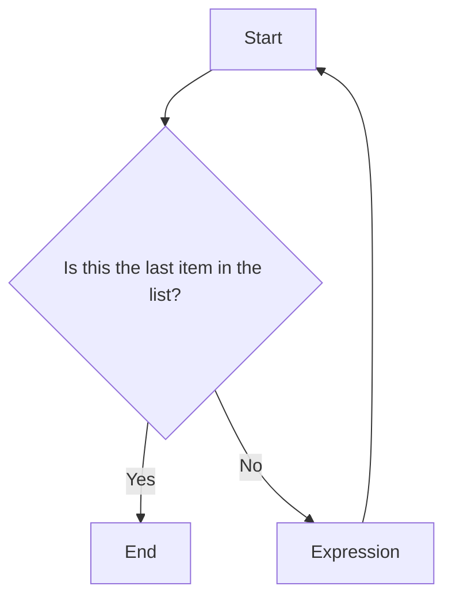
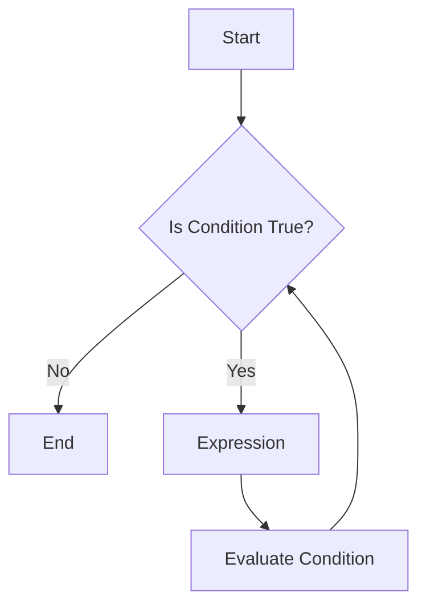

# Controlling Program Flow
## Building Complex Logic 


    
---

# Types of Control Structures
Controlling when and what to execute

** **

<v-click>

**Four Ways to Control Code** 
  1. Sequential (Default) 
      - Code runs one after the other, i.e. top-to-bottom 

</v-click>

<v-click>

  2. Selection (Conditional)
      - **if** / **if-else** / **if-elif-else**: 
      execute code <ins>if</ins> a statement is `True` <ins>else</ins> execute another piece of code   
      
</v-click>

<v-click>

  3. Iteration (Loops)
      - **For**: Execute code a finite number of times
      - **While**: Execute code as long as a statement remains `True`
      - Controlling loops: **break**, **continue**, **pass**
</v-click>

<v-click>

  4. Try-Except (Try and fail/Gung ho)
      - **try-except-finally**: try to execute code, if fail, try alternative.
</v-click>

---

# Selection (Conditional) Control
if/if-else/if-elif-else

** **
## Logic flow
- if-elif-else code is executed in order starting from if, then elif, then else. Think of it as a switch
- You must have **if** first, then any number of **elif**, then **else**
- Condition is any code that generates a boolean output




---

# Selection (Conditional) Control

** **
Indent (Tab) is used to identify code-blocks. The logic is executed in order starting with **if** first, then **elif** etc..

<v-click>

- **if** syntax
  ```python
  if condition:
    expression
  ```
</v-click>

<v-click>

- **if-else** syntax
  ```python
  if condition:
    expression
  else:
    expression
  ```
</v-click>

<v-click>

- **if-elif-else** syntax
  ```python
  if condition:
    expression
  elif condition:
    expression
  else:
    expression
  ```
</v-click>

<v-click>

  - You can add an infinite amount of `elif` before the `else`.
</v-click>

---

# Selection (Conditional) Control
if/if-else/if-elif-else

** **
## Example
- We use if-elif-else to test whether 3 is divisible by 2 or 3. 

<v-click>

  ```python
  z = 3

  if z % 2 == 0:
      print("z is divisible by 2")
  elif z % 3 == 0:
      print("z is divisible by 3")
  else:
      print("z is neither divisible by 2 nor by 3")
  ```
- `%` is the modulo operator which gives the integer remainder of the left number when divided by the right
</v-click>

<v-click>

## What is the answer?
```python
  "z is divisible by 3"
```
</v-click>

---
layout: two-cols-header
---

# Iteration (Loops) Control
For and While

** **

::left:: 

## For: 
- Do X for every item in a finite list of items

<p style="text-align:center;">

</p>

::right:: 

## While: 
- Do X until a Condition is False 

<p style="text-align:center;">

</p>


---

# Iteration (Loops) Control
For and While

** **
**For** can be used to iterate over a list (array) in many different ways

<v-click>

  ```python
  x = ['cats','dogs','humans','aliens']
  ```
</v-click>

<v-click>

1. Directly iterate over the items

  ```python
    for item in x:
      print(item)
  ```
</v-click>

<v-click>

2. Create an index for each item in list and iterate
  ```python
    for i in range(len(x)):
      item = x[i]
      print(i, item)
  ```
</v-click>

<v-click>

3. Use `enumerate` to both generate index and iterate item
  ```python
    for i, item in enumerate(x):
      print(i, item)
  ```  
</v-click>


---

# Iteration (Loops) Control
For and While

** **
- Combined with slicing, `::` or indexing `range`, **for** can iterate over a subset of the list 

<v-click>

1. using slicing, `start:stop:step`
  ```python
    for item in x[::2]: # take every 2nd item including the first.
      print(item)
  ```
</v-click>

<v-click>

2. using indexing, `range(start:stop:step)`
  ```python
    for i in range(0,len(x),2): # take every 2nd item including the first.
      print(i,item)
  ```
</v-click>

<v-click>

- Indexing, offers the greatest flexibility and control. You can use the index to access data stored in other arrays to perform computation. 
</v-click>


---

# Iteration (Loops) Control
For and While

** **
- While loops are used for early termination, primarily if you don't know how many iterations is needed
  - e.g. searching for `'dogs'` in the list

  <v-click>

  1. (Using for loop):
    ```python 
    for i, item in enumerate(x): # take every 2nd item including the first.
      if item == 'dogs':
        # do something
        break # early termination of a finite list
    print(i)
    ```
  </v-click>

  <v-click>

  2. (Using while loop):
    ```python 
    is_dogs = False # set a condition to test
    i = 0 # set index
    while is_dogs==False:
      item = x[i]
      is_dogs = item == 'dogs' # re-evaluate the condition
      i=i+1 # update index
    print(i)
    ```
  </v-click>


---

# Iteration (Loops) Control
Controlling loop execution

** **
- Looping over every item is a slow process. We may want to only operate on certain items, skipping or terminating early
- Python offers 3 control statements:
