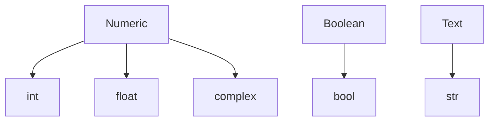
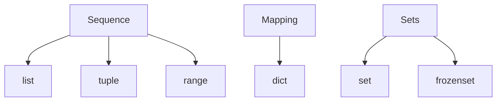

# Python Data Structures
## Storing and Manipulating Data in Python

---

# Python Data Types
How are types handled in python?
** **
<br>

- Compiled languages like Java, C/C++, etc. are <i>statically typed</i>, where types are determined at compile time. Python is **dynamically typed**: types are determined at runtime.

 ```c++
    // C++
    float x = 0.0f;
 ```
 ```python
    # python
    x = 0.0
 ```

<v-click>

- Instead of explicit definitions, the <u><b>value</b></u> determines the type!

```python
    x = 10      # creates int
    y = 10.0    # creates float
```
</v-click>
<v-click>

- Use the ```type()``` keyword to return the type:

<table><tbody><tr>
<td>

 ```python
    print(type(x), type(y))
 ```

</td>
<td>

 ```console
    <class 'int'> <class 'float'>
 ```

</td>
</tr></tbody></table>

</v-click>


---

# Python Data Types
How are types handled in python?
** **
- Why is the type ```<class 'float'>``` and not just ```float```?

<v-click>
    <p style="text-align: center"><b>
        Every <span style="color:red">value</span> in Python is an object!
        <br><br> <span style="color:green">Variables</span> are merely references to these objects.
    </b></p>
</v-click>

<v-click>

- When we write ```x = 10```, python checks the type of the <b><span style="color:red">value</span></b> 10 and creates an instance of the ```int()``` class. 
The <b><span style="color:green">variable x</span></b> is then assigned to that object. 
</v-click>
<v-click>

- If we now write ```x = 11```, the object in memory representing "10" gets destroyed and a new ```int()``` is created somewhere else. <b>This is different from other languages.</b>
</v-click>
<v-click>

- This happens because the ```int``` types are <u><b>immutable</b></u>, meaning they <u>cannot be changed once created</u>.
</v-click>

---

# Mutability vs. Immutability

- <b>Mutability</b> refers to an objects ability to change state (or <u>mutate</u>) once created.

<v-click>

- If an object is <b>immutable</b>, its content cannot be changed "in-place". Changes to these objects are handled by creating copies of the object at a new location in memory.
</v-click>
<v-click>

- In Python, the <u>basic data-types</u> such as ```int, float, str```, etc are all <u>immutable</u>.
</v-click>
<v-click>

#### <u>Example</u>: We can use the ```id()``` keyword to see what happens in memory when we modify an ```int``` vs. a ```list```.

<table><tbody><tr>
<td>

 ```python
   x = 10
   print("x =", x, "at", id(x))
   x = x + 1
   print("x =", x, "at", id(x))
   y = [1,2,3]
   print("y =", y, "at", id(x))
   y += [4]
   print("y =", y, "at", id(x))
 ```

</td>
<td>

 ```console
   x = 10 at 140728423185112
   x = 11 at 140728423185144
   y = [1, 2, 3] at 140728423185144
   y = [1, 2, 3, 4] at 140728423185144
 ```

Note that the address of ``x`` has changed, while the address of ``y`` has not. This is because ``int`` is immutable and ``list`` is mutable!

</td>
</tr></tbody></table>

</v-click>

---

# Built-in Data Types
Basic data types to store single-values of things like numbers and text.
** **

<br>


<v-click>

- Class-nature of types allows us to freely convert between types by <b>type casting</b>:

<table><tbody><tr>
<td>

 ```python
    x = '5'
    y = float(x)
    z = bool(y)
    print("x =", x, "y =", y, "z =", z)  
 ```

</td>
<td>

 ```console
    x = 5 y = 5.0 z = True
 ```

</td>
</tr></tbody></table>

</v-click>
<v-click>

- Note the behaviour of ```bool()``` typecasting! Each type evaluates to ```True/False``` differently. Here we got <br>```z = True``` because ```y is not 0.0```. (More on this later!)

</v-click>

---

# Numeric Types

- Numeric types implement the basic arithmetic operations such as ```+, -, / and *```.

<v-click>

- Any mixing of ```int``` and ```float``` results in type conversion to ```float```.
<table><tbody><tr>
<td>

 ```python
    print(type(5 + 2))
    print(type(5 + 2.0))
 ```

</td>
<td>

 ```console
    <class 'int'>
    <class 'float'>
 ```

</td>
</tr></tbody></table>

</v-click>
<v-click>

- ```float``` may be written in scientific notation:
<table><tbody><tr>
<td>

 ```python
    x = -1.2e3
    print(x)
 ```

</td>
<td>

 ```console
    -1200.0
 ```

</td>
</tr></tbody></table>

</v-click>
<v-click>

- Complex numbers are represented in the format ```[a] + [b]j```, e.g. the imaginary unit "i" is ```1j```. ```complex``` types store the <u>real</u> and <u>imaginary</u> components of complex numbers:
<table><tbody><tr>
<td>

 ```python
    z = 1 + 2j
    print(type(z))
    print(z.real)
    print(z.imag)
 ```

</td>
<td>

 ```console
    <class 'complex'>
    1.0
    2.0
 ```

</td>
</tr></tbody></table>

</v-click>

--- 

# Strings

- Store words, phrases, paths... Anything represented as text!

<v-click>

- Create using <u>either</u> ``` ' ' ``` or ``` " " ```:
<table><tbody><tr>
<td>

 ```python
    a = "Hello!"
    print(a)
 ```

</td>
<td>

 ```console
    Hello!
 ```

</td>
</tr></tbody></table>

</v-click>
<v-click>

- Strings support some arithmetic operations for manipulation, like ```+, *```:
<table><tbody><tr>
<td>

 ```python
   b = a + " World!"
   c = a*3
   print(b)
   print(c)
 ```

</td>
<td>

 ```console
   Hello! World!
   Hello!Hello!Hello!
 ```

</td>
</tr></tbody></table>

</v-click>
<v-click>

- Strings are just <u><b>Arrays</b></u> of single characters. They have a length and you can access its elements:
<table><tbody><tr>
<td>

 ```python
   print(len(a)) # length
   print(a[1:4]) # substring
 ```

</td>
<td>

 ```console
   6
   ell
 ```

</td>
</tr></tbody></table>

</v-click>

--- 

# Strings (cont'd)

- ```f-strings```: convenient way of string formatting with variables. Begin the string with ```f``` flag and use ```{}``` to insert variables into strings.
<table><tbody><tr>
<td>

 ```python
   a, b = (3,5)
   s = f"{a} plus {b} is equal to {float(a+b)}"
   print(s)
 ```

</td>
<td>

 ```console
   3 plus 5 is equal to 8.0
 ```

</td>
</tr></tbody></table>

<v-click>

- The ```in``` keyword can be used to search for substrings:
<table><tbody><tr>
<td>

 ```python
   print("plus" in s)

   if "!!!" not in s:
      print(s + "!!!")
 ```

</td>
<td>

 ```console
   True
   3 plus 5 is equal to 8.0!!!
 ```

</td>
</tr></tbody></table>

</v-click>

---

# Built-in Data Structures
Useful data types to store collections of data.
** **
<br><br>
- Python has several types which handle multiple elements, each with different behaviour.
<v-click>

<br>


</v-click>
<v-click>

- We will focus on ```list```, ```tuple``` and ```dict```.

</v-click>

---

# Lists

Essentially Python's answer to what other languages call <u>arrays</u>.
<br><br>

<v-click>

#### Properties of ```list```: <b>&emsp;ordered&emsp;mutable&emsp;allow duplicates</b>

</v-click>
<v-click>

<br>
- Create a list using square brackets, ```[ ]```:

```python
names = ["susan", "mike", "susan", "joe"] # here we use str, but can be any object!
```

- Or using the constructor directly with some other iterable data type:

```python
names = list(("susan", "mike", "susan", "joe")) # creating a list from a tuple
```

</v-click>
<v-click>

- The items in a list are indexed, starting at 0. You can access items in a list by indexing, either relative to the start or the end:

<table><tbody><tr>
<td>

 ```python
   print(names[1])
   print(names[-1])
 ```

</td>
<td>

 ```console
   mike
   joe
 ```

</td>
</tr></tbody></table>

</v-click>

--- 

# Lists (cont'd)

- Recall ```list``` are <u>mutable</u>; we can freely change its values:
<table><tbody><tr>
<td>

```python
names[0] = "kevin"
```

</td>
<td>

```console
['kevin', 'mike', 'susan', 'joe']
```

</td>
</tr></tbody></table>

<v-click>

- Add list items using ```.append()``` or the ```+``` operator:

<table><tbody><tr>
<td>

```python
names.append("conor")
names += ["felix"] # added item must be list
```

</td>
<td>

```console
['kevin', 'mike', 'susan', 'joe', 'conor', 'felix']
```

</td>
</tr></tbody></table>

</v-click>
<v-click>

- Remove list items using ```.remove()```, ```.pop()``` or the ```del``` keyword:

<table><tbody><tr>
<td>

```python
names.remove("mike")
temp = names.pop(2) # note that pop returns the value!
del names[1]
print(names, temp, "was popped")
```

</td>
<td>

```console
['kevin', 'conor', 'felix'] joe was popped
```

</td>
</tr></tbody></table>

</v-click>

---

# Lists (cont'd)

- Use ```.sort()``` to sort items alphanumerically:

<table><tbody><tr>
<td>

```python
names.sort()
numbers = [5, -1, 10, -3]
numbers.sort()
```

</td>
<td>

```console
names:   ['conor', 'felix', 'kevin']
numbers: [-3, -1, 5, 10]
```

</td>
</tr></tbody></table>

<v-click>

- We will go over ```for``` loops later, but FYI ```list``` are <u>```iterable```</u>, which means they can be looped through.

</v-click>
 
---

# Tuples

Like ```list```, but with different purpose and behaviour.

<v-click>


#### Properties of ```tuple```: <b>&emsp;ordered&emsp;<u>immutable</u>&emsp;allow duplicates</b>
<br>
</v-click>
<v-click>

- Note the difference here: ```tuple``` is <u>immutable</u> - its contents can't be changed once created!

</v-click>
<v-click>

- Like list, create a tuple using square brackets, ```( )``` or ```tuple()```:

```python
seasons = ("fall", "winter", "spring", "summer")
seasons = tuple(["fall", "winter", "spring", "summer"])
```

</v-click>
<v-click>

- Now if we try and change our ```tuple```, e.g. changing "winter" to "summer":

```python
seasons[1] = "summer"
```
```console
TypeError: 'tuple' object does not support item assignment
```

</v-click>

---

# Tuples (Cont'd)

Use ```tuple``` for collections of data which you are sure should not change!

<v-click>

#### OK... but why not just use ```list```?

</v-click>
<v-click>

   1. Immutability means they are ```hashable```: Makes parsing ```tuple``` slightly faster, more memory efficient.
   1. Makes your code <u>clearer</u> and <u>safer</u> for anyone working on it.
   1. From the <b>Zen of Python</b>: <i>Explicit is better than implicit. Readability counts.</i>

</v-click>
<v-click>
<br>

- Like ```list```, ```tuple``` can be appended to:

<table><tbody><tr>
<td>

```python
seasons = ("fall", "winter", "spring")
print(id(seasons))
seasons += ("summer",)
print("seasons:", seasons)
print(id(seasons))
```

</td>
<td>

```console
2104399491776
seasons: ("fall", "winter", "spring", "summer")
2104399162848
```

</td>
</tr></tbody></table>

</v-click>
<v-click>

- Note that immutability still holds here: the ```id``` of ```seasons``` has changed!

</v-click>

---

# Mutability Matters! Be wary of implications...

<v-click>

```python
my_list = [1,2,3]

def change_list(l: list): # passed by reference
    l += [4]
    print("l =", l) # l = [1, 2, 3, 4]

change_list(my_list)
print("my_list =", my_list) # my_list = [1, 2, 3, 4]

my_tuple = (1,2,3)

def change_tuple(t: tuple): # passed by value
    t += (4,)
    print("t =", t) # t = (1, 2, 3, 4)

change_tuple(my_tuple)
print("my_tuple =", my_tuple) # my_tuple = (1, 2, 3)
```

</v-click>
<v-click>

```python
# aliasing
list1 = ['a', 'b']
list2 = list1 # 2 references 1
list2[0] = 'c'
print(list1) # ['c', 'b'] (both are changed!)
```

</v-click>

---

# Dictionaries (```dict```)

Python's version of maps which store data in <b>key : value</b> pairs.
<br>
#### Properties of ```dict```: <b>&emsp;ordered&emsp;mutable&emsp;NO duplicates!</b>

<v-click>
<br>

- <u>NO duplicates</u> in the sense that a ```dict``` can't have duplicate ```keys```.

</v-click>
<v-click>

- Create ```dict``` using ```{ }``` in ```{key: value}``` format, or using the constructor (not common):

```python
employee = {
   "name": "Clara",
   "age": 32,
   "id": 12345
}
employee = dict(name = "Clara", age = 32, id = 12345)
```

</v-click>
<v-click>

- Access ```dict``` items using ```mydict[key]``` format:

<table><tbody><tr>
<td>

```python
print(employee["name"])
```

</td>
<td>

```console
Clara
```

</td>
</tr></tbody></table>

</v-click>

---

# Dictionaries (```dict```)

- To add new items, simply create a new key:

<table><tbody><tr>
<td>

```python
employee["salary"] = 1.2e5
```

</td>
<td>

```console
employee: {'name': 'Clara', 'age': 32, 'id': 12345, 'salary': 120000.0}
```

</td>
</tr></tbody></table>

<v-click>

- Using ```.keys()``` will give you a ```dict_keys``` object, which you can convert to ```list```:

<table><tbody><tr>
<td>

```python
print(list(employee.keys()))
```

</td>
<td>

```console
['name', 'age', 'id', 'salary']
```

</td>
</tr></tbody></table>

</v-click>
<v-click>

- ```dict``` <i>values</i> can be any type, even ```dict```:

<table><tbody><tr>
<td>

```python
company = {
    "name": "Bell Telephones",
    "employee": employee
}
print(company) 
```

</td>
<td>

```console
{'name': 'Bell Telephones', 
   'employee': {'name': 'Clara', 'age': 32, 'id': 12345, 'salary': 120000.0}
}
```

</td>
</tr></tbody></table>

</v-click>
<v-click>

- ```dict``` <i>keys</i> can be any <i>hashable</i> type, i.e. any immutable type, even ```tuple```!

</v-click>

---
layout: center
---

# Activity
Get practice storing and manipulating patient data in Python data structures.