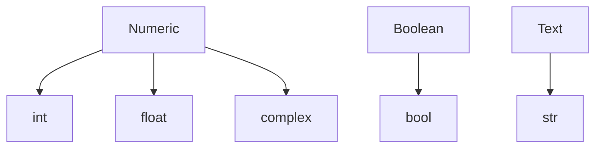
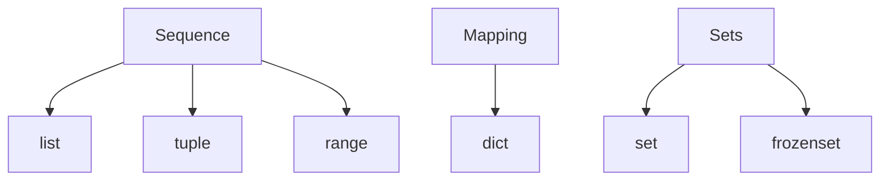

# Python Data Structures
## Storing and Manipulating Data in Python

---

# Python Data Types
How is typing handled in python?
** **

- Compiled languages like Java, C/C++, etc. are <i>statically typed</i>, where types are determined at compile time. Python is **dynamically typed**: types are determined at runtime.

 ```c++
    // C++
    float x = 0.0f;
 ```
 ```python
    # python
    x = 0.0
 ```
- Instead of explicitly defining, the <u><b>value</b></u> determines the type!

```python
    x = 0.0     # creates float
    y = 0       # creates int
```

- Use the ```type()``` keyword to return the type:

 ```python
    print(type(x), type(y))
 ```
 ```console
    <class 'float'> <class 'int'>
 ```

---

# Python Data Types
How is typing handled in python?
** **
- Why ```<class 'float'>``` and not just ```float```?

    <p style="text-align: center"><b>
        Everything in Python is an object!
    </b></p>

- When we assign the value ```0.0``` to the variable ```x```, python checks it's <u>value</u> and creates an instance of the ```float()``` class!

- We can even peek into ```class float``` using ```help(x)```:

```python
class float(object)
 |  float(x=0, /)
 |
 |  Convert a string or number to a floating point number, if possible.
 |
 |  Methods defined here:
 |
 |  __abs__(self, /)
 |      abs(self)
 |
 |  __add__(self, value, /)
 |      Return self+value.
```

---

# Built-in Data Types
Basic data types to store single-values of things like numbers and text.
** **

<br>


- Class-nature of types allows us to freely convert between types by <b>type casting</b>:

 ```python
    x = '5'
    y = float(x)
    z = bool(y)
    print("x =", x, "y =", y, "z =", z)    
 ```
 ```console
    x = 5 y = 5.0 z = True
 ```

- Note the behaviour of ```bool()``` typecasting! Each type evaluates to ```True/False``` differently. Here we got ```True``` because ```z is not 0.0```. (More on this later!)

---

# More on Type Behaviour

---

# Built-in Data Structures
Useful data structures to datasets with many members.
** **

<br>
