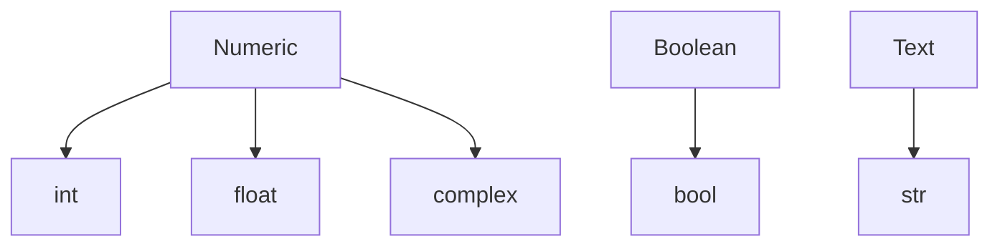
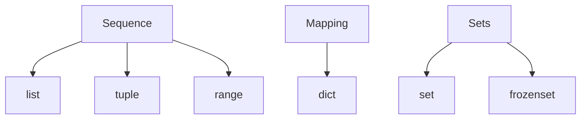

# Python Data Structures
## Storing and Manipulating Data in Python

---

# Python Data Types
How are types handled in python?
** **
<br>

- Compiled languages like Java, C/C++, etc. are <i>statically typed</i>, where types are determined at compile time. Python is **dynamically typed**: types are determined at runtime.

 ```c++
    // C++
    float x = 0.0f;
 ```
 ```python
    # python
    x = 0.0
 ```
- Instead of explicit definitions, the <u><b>value</b></u> determines the type!

```python
    x = 10      # creates int
    y = 10.0    # creates float
```

- Use the ```type()``` keyword to return the type:

<table><tbody><tr>
<td>

 ```python
    print(type(x), type(y))
 ```

</td>
<td>

 ```console
    <class 'int'> <class 'float'>
 ```

</td>
</tr></tbody></table>

---

# Python Data Types
How are types handled in python?
** **
- Why is the type ```<class 'float'>``` and not just ```float```?

    <p style="text-align: center"><b>
        Every <span style="color:red">value</span> in Python is an object!
        <br><br> <span style="color:green">Variables</span> are merely references to these objects.
    </b></p>

- When we write ```x = 10```, python checks the type of the <b><span style="color:red">value</span></b> 10 and creates an instance of the ```int()``` class. 
The <b><span style="color:green">variable x</span></b> is then assigned to that object. 

- If we now write ```x = 11```, the object in memory representing "10" gets destroyed and a new ```int()``` is created somewhere else. <b>This is different from other languages.</b>

- This happens because the ```int``` types are <u><b>immutable</b></u>, meaning they <u>cannot be changed once created</u>.

---

# Mutability vs. Immutability

- <b>Mutability</b> refers to an objects ability to change state (or <u>mutate</u>) once created.

- If an object is <b>immutable</b>, its content cannot be changed "in-place". Changes to these objects are handled by creating copies of the object at a new location in memory.

- In Python, the <u>basic data-types</u> such as ```int, float, str```, etc are all <u>immutable</u>.

#### <u>Example</u>: We can use the ```id()``` keyword to see what happens in memory when we modify an ```int``` vs. a ```list```.

<table><tbody><tr>
<td>

 ```python
   x = 10
   print("x =", x, "at", id(x))
   x = x + 1
   print("x =", x, "at", id(x))
   y = [1,2,3]
   print("y =", y, "at", id(x))
   y += [4]
   print("y =", y, "at", id(x))
 ```

</td>
<td>

 ```console
   x = 10 at 140728423185112
   x = 11 at 140728423185144
   y = [1, 2, 3] at 140728423185144
   y = [1, 2, 3, 4] at 140728423185144
 ```

Note that the address of ``x`` has changed, while the address of ``y`` has not. This is because ``int`` is immutable and ``list`` is mutable!

</td>
</tr></tbody></table>

---

# Built-in Data Types
Basic data types to store single-values of things like numbers and text.
** **

<br>


- Class-nature of types allows us to freely convert between types by <b>type casting</b>:

<table><tbody><tr>
<td>

 ```python
    x = '5'
    y = float(x)
    z = bool(y)
    print("x =", x, "y =", y, "z =", z)  
 ```

</td>
<td>

 ```console
    x = 5 y = 5.0 z = True
 ```

</td>
</tr></tbody></table>

- Note the behaviour of ```bool()``` typecasting! Each type evaluates to ```True/False``` differently. Here we got <br>```z = True``` because ```y is not 0.0```. (More on this later!)

---

# Numeric Types

- Numeric types implement the basic arithmetic operations such as ```+, -, / and *```.

- Any mixing of ```int``` and ```float``` results in type conversion to ```float```.
<table><tbody><tr>
<td>

 ```python
    print(type(5 + 2))
    print(type(5 + 2.0))
 ```

</td>
<td>

 ```console
    <class 'int'>
    <class 'float'>
 ```

</td>
</tr></tbody></table>

- ```float``` may be written in scientific notation:
<table><tbody><tr>
<td>

 ```python
    x = -1.2e3
    print(x)
 ```

</td>
<td>

 ```console
    -1200.0
 ```

</td>
</tr></tbody></table>

- Complex numbers are represented in the format ```[a] + [b]j```, e.g. the imaginary unit "i" is ```1j```. ```complex``` types store the <u>real</u> and <u>imaginary</u> components of complex numbers:
<table><tbody><tr>
<td>

 ```python
    z = 1 + 2j
    print(type(z))
    print(z.real)
    print(z.imag)
 ```

</td>
<td>

 ```console
    <class 'complex'>
    1.0
    2.0
 ```

</td>
</tr></tbody></table>
--- 

# Strings

- Store words, phrases, paths... Anything represented as text!

- Create using <u>either</u> ``` ' ' ``` or ``` " " ```:
<table><tbody><tr>
<td>

 ```python
    a = "Hello!"
    print(a)
 ```

</td>
<td>

 ```console
    Hello!
 ```

</td>
</tr></tbody></table>

- Strings support some arithmetic operations for manipulation, like ```+, *```:
<table><tbody><tr>
<td>

 ```python
   b = a + " World!"
   c = a*3
   print(b)
   print(c)
 ```

</td>
<td>

 ```console
   Hello! World!
   Hello!Hello!Hello!
 ```

</td>
</tr></tbody></table>

- Strings are just <u><b>Arrays</b></u> of single characters. They have a length and you can access its elements:
<table><tbody><tr>
<td>

 ```python
   print(len(a)) # length
   print(a[1:4]) # substring
 ```

</td>
<td>

 ```console
   6
   ell
 ```

</td>
</tr></tbody></table>

--- 

# Strings (cont'd)

- ```f-strings```: convenient way of string formatting with variables. Begin the string with ```f``` flag and use ```{}``` to insert variables into strings.
<table><tbody><tr>
<td>

 ```python
   a, b = (3,5)
   s = f"{a} plus {b} is equal to {float(a+b)}"
   print(s)
 ```

</td>
<td>

 ```console
   3 plus 5 is equal to 8.0
 ```

</td>
</tr></tbody></table>

- The ```in``` keyword can be used to search for substrings:
<table><tbody><tr>
<td>

 ```python
   print("plus" in s)

   if "!!!" not in s:
      print(s + "!!!")
 ```

</td>
<td>

 ```console
   True
   3 plus 5 is equal to 8.0!!!
 ```

</td>
</tr></tbody></table>

--- 

# Boolean Values

---

# Built-in Data Structures
Useful data types to store collections of data.
** **

- Python has several options to store data with multiple elements, each with different behaviour.

<br>


---

# Lists

- Essentially Python's answer to what other languages call <u>arrays</u>.
<br><br>
#### Properties of ```list```:
<table align="center"><thead><tr>
<th>ordered</th>
<th>mutable</th>
<th>allow duplicates</th>
</tr></thead></table>

- Create a list using square brackets, ```[ ]```:

```python
   names = ["susan", "mike", "susan", "joe"] # here we use str, but can be any object!
```

- The items in a list are indexed, starting at 0. You can access items in a list by indexing, either relative to the start or the end:

<table><tbody><tr>
<td>

 ```python
   print(names[1])
   print(names[-1])
 ```

</td>
<td>

 ```console
   mike
   joe
 ```

</td>
</tr></tbody></table>

--- 

# Lists (cont'd)

- Recall ```list``` are <u>mutable</u>; we can freely change its values:
<table><tbody><tr>
<td>

 ```python
   names[0] = "kevin"
   print(names)
 ```

</td>
<td>

 ```console
   ['kevin', 'mike', 'susan', 'joe']
 ```

</td>
</tr></tbody></table>

---

# Tuples

---

# Dictionaries (```dict```)

---

# Dictionaries (```dict```)