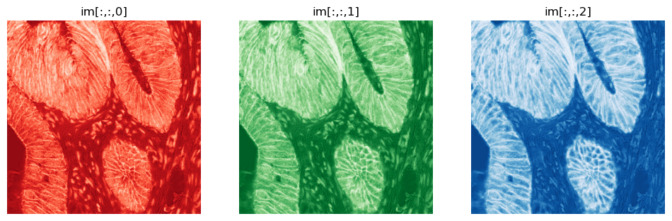
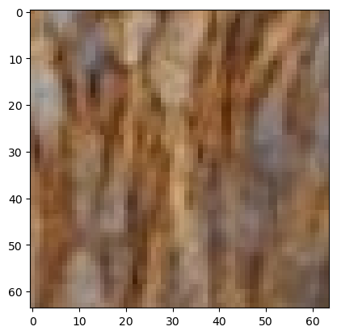
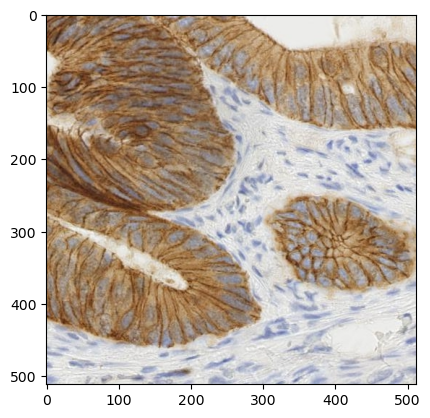
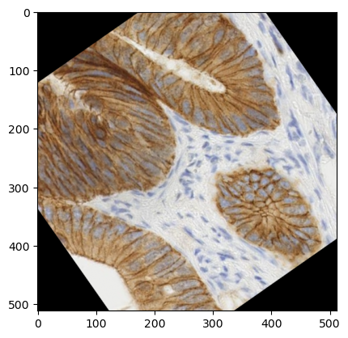
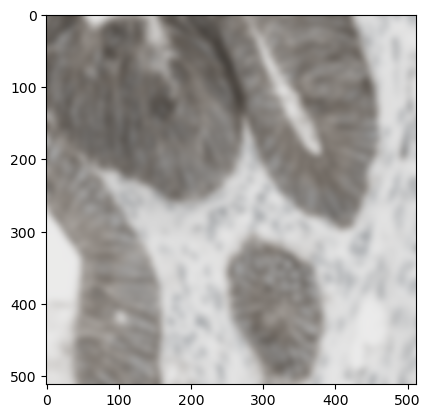
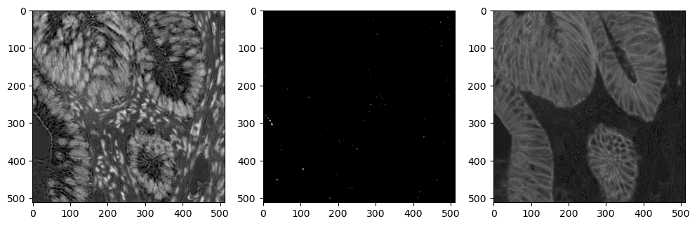
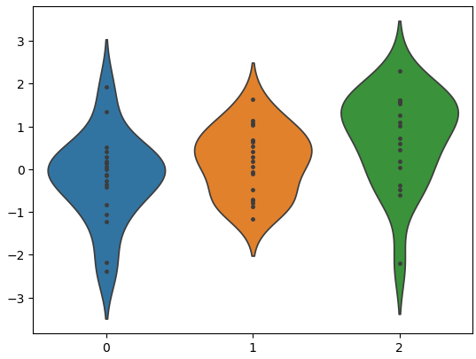

# Scientific Computing Basics

## Leveraging powerful tools in Python for scientific data analysis.

---

# Introducing ```NumPy``` (<b>Num</b>erical <b>Py</b>thon)
Effecient mathematical operations on N-dimensional data.

First, lets import the library:
```python
import numpy as np
```

- ```Lists``` are versatile in that they can store heterogeneous data and can have "ragged" dimensions.

- Many applications, however, involve operations on rectangular N x M (or more) arrays of the same type, e.g. <b>matrix operations</b>. This is where NumPy really shines!

- If you have used MATLAB, NumPy will be very familiar!
<br>
#### Fundemental type: <b>numpy.ndarray</b>
Create using any rectangular list (or tuple) of a single type:
```python
arr = np.array([[1,2,3,4],[5,6,7,8]])
```

- Can also "initialize" with ```np.zeros, np.ones, np.empty, np.random```, and more.

---

# Introducing ```NumPy``` (<b>Num</b>erical <b>Py</b>thon)

- The power of ```ndarray``` is the ability to perform mathematical operations on them:

<table><tbody><tr>
<td>

 ```python
# scalar operations...
a = np.array([[1,2,3,4],[5,6,7,8]])
a = a * 2 + 1
print("a:", a)
# matrix operations...
b = np.ones(a.shape)
print("b:", b)
print("a + b:", a + b)
 ```

</td>
<td>

 ```console
a: [[ 3  5  7  9]
 [11 13 15 17]]
b: [[1. 1. 1. 1.]
 [1. 1. 1. 1.]]
a + b: [[ 4.  6.  8. 10.]
 [12. 14. 16. 18.]]
 ```

</td>
</tr></tbody></table>

- In addition to <i>slicing</i> (recall w/ ```list```), ```ndarray``` supports <b>Integer</b> and <b>Boolean</b> indexing:

<table><tbody><tr>
<td>

 ```python
# create some random integers
a = np.random.randint(-10,10, size=(3,3))
print(a)
# access only diagonals (Integer indexing)
print("diag:", a[[0,1,2],[0,1,2]])
# acess only > 0 (Boolean indexing)
print("positive:", a[a > 0])
 ```

</td>
<td>

 ```console
[[-5 -6 -9]
 [-7  6  7]
 [ 9  0  2]]
diag: [-5  6  2]
positive: [6 7 9 2]
 ```

</td>
</tr></tbody></table>

---

# Broadcasting 

NumPy handles operations between differently sized arrays by <i>stretching</i> along the larger axis.

<table><tbody>

<tr>
<td>

</td>
<td>

 ```python
 a = np.array([1,2,3])
 print(a * 2)
 ```
 ```console
 [2, 4, 6]
 ```

</td>
</tr>

<tr>
<td>

</td>
<td>

 ```python
 a = np.array([[0, 0, 0],[10,10,10],[20,20,20],[30,30,30]])
 b = np.array([1,2,3])
 print(a + b)
 ```
 ```console
 [[ 1  2  3], [11 12 13], [21 22 23], [31 32 33]]
 ```

</td>
</tr>

<tr>
<td>

</td>
<td>

 ```python
 a = np.array([0, 10, 20, 30])
 b = np.array([1, 2, 3])
 print( a[:, np.newaxis] + b )
 ```
 ```console
 [[ 1  2  3], [11 12 13], [21 22 23], [31 32 33]]
 ```

</td>
</tr>

</tbody></table>

---

# And so much more!

** **
<br>

### Basic Math: ```np.sin, np.cos, np.exp, np.log, ...```

### Statistics: ```np.mean, np.std, np.max, np.sum, ...```

### Linear algebra: ```np.transpose, np.invert, np.dot, np.cross, ...```

### Fourier domain: ```np.fft.fft/fft2, np.fft.ifft/ifft2, ...```
<br><br>
## ```NumPy``` can do a ton! Let's not get too bogged down...
## But as usual, <a href="https://numpy.org/">read the docs</a>. 

---

# Loading Images

- Numerous packages exist which can load images easily. Some common ones are:

<table><tbody>
<tr><td>Matplotlib</td>
<td>

```python
import matplotlib.pyplot as plt
im = plt.imread('img.png')
```

</td></tr>
<tr><td>PIL</td>
<td>

```python
from PIL import Image
im = Image.open('img.png')
```

</td></tr>
<tr><td>OpenCV</td>
<td>

```python
from cv2
im = cv2.imread('img.png')
```

</td></tr>
<tr><td>Scikit-Image</td>
<td>

```python
from skimage import io
io.imread('img.png')
```

</td></tr>
</tbody></table>

--- 

# Working with Images

- Let's load an image using some of the tools that we're already familiar with:

<table><tbody><tr>
<td>

```python
from skimage import io
import matplotlib.pyplot as plt

im = io.imread("..\\datasets\\images\\ihc.png")
plt.imshow(im)
```

</td>
<td>


</td>
</tr></tbody></table>

- What are some of the properties of our image?


<table><tbody><tr>
<td>

```python
print(type(im))
print(im.shape)
```

</td>
<td>

```console
<class 'numpy.ndarray'>
(512, 512, 3)
```

</td>
</tr></tbody></table>

- Many image analysis packages default to ```numpy.ndarray``` as the image datatype, making them convenient to work with.

---

# Working with Images

### RGB Color

- Note the 3rd dimension on our image: these are the <b>red, green, blue 
(<span style="color:red">R</span>
<span style="color:green">G</span>
<span style="color:blue">B</span>)
</b> components of our image.

<center>
    
</center>

- If we ``print(im)`` directly...

<center>
```console
array([[[156, 118,  81],
        [163, 125,  88],
        [156, 116,  81], 
        ..., etc
```
</center>

... we see that each pixel has the form <b>\[r, g, b\]</b>. Combined these values can form any color, but sometimes it may be useful to work with the RGB channels individually.

--- 

# Manipulating Images with NumPy

The ```ndarray``` nature of images allows us manipulate them as with any NumPy array.

<table><tbody><tr>
<td>

##### Cropping

```python
plt.imshow(im[64:128, 64:128, :])
```

</td>
<td>



</td>
</tr></tbody></table>

<table><tbody><tr>
<td>

##### Rotate

```python
plt.imshow(im.swapaxes(0,1))
```

</td>
<td>



</td>
</tr></tbody></table>

<table><tbody><tr>
<td>

##### Downsample

```python
plt.imshow(im[::16, ::16, :])
```

</td>
<td>


</td>
</tr></tbody></table>

---

# Introduction to `scikit-image`

Designed for advanced image processing, building on `NumPy` to simplify and enhance image manipulation.

- **Advantages over Basic NumPy**:
   - Provides specialized image processing functions that would be complex to do with `NumPy` alone.
   - Handles various image formats, color spaces, and built-in filters efficiently.
   - Includes pre-built tools for common image tasks.

- **Key Image Processing Tasks**:
   - **Image Filtering**: Smoothing, sharpening, and edge detection.
   - **Segmentation**: Isolating regions of interest (e.g., objects, boundaries).
   - **Feature Extraction**: Identifying patterns and structures (e.g., corners, edges).
   - **Geometric Transformations**: Resizing, rotating, and warping images.
   - **Color Space Manipulation**: Converting between RGB, grayscale, HSV, etc.

---

# Manipulating Images with `scikit-image`

<table><tbody><tr>
<td>

##### Arbitrary Rotation

```python
from skimage import transform

plt.imshow(transform.rotate(im, angle=35.0, resize=False))
```

</td>
<td>



</td>
</tr></tbody></table>

<table><tbody><tr>
<td>

##### Gaussian Filtering

```python
from skimage import filters

plt.imshow(filters.gaussian(im, sigma=5.0))
```

</td>
<td>



</td>
</tr></tbody></table>

<table><tbody><tr>
<td>

##### Spectral Unmixing and Contrast Adjust

```python
from skimage import color, exposure
im_hed = color.rgb2hed(im)
fig, ax = plt.subplots(1,3, figsize=(12,4))
ax[0].imshow(exposure.adjust_gamma(im_hed[:,:,0], gamma=0.6), cmap='gray')
ax[1].imshow(exposure.adjust_gamma(im_hed[:,:,1], gamma=0.1), cmap='gray')
ax[2].imshow(exposure.adjust_gamma(im_hed[:,:,2], gamma=0.4), cmap='gray')
```

</td>
<td>



</td>
</tr></tbody></table>

---

# Introduction to <b>Sci</b>entific <b>Py</b>thon: `SciPy`

Python library built on `NumPy` that adds powerful tools for scientific and statistical analysis.

- **Advantages over NumPy**:
   - Provides advanced functionality for statistical analysis, hypothesis testing, and scientific computing.
   - Includes modules for linear algebra, optimization, signal processing, and integration, making it ideal for in-depth scientific analysis.
   - Offers high-level statistical tests (e.g., t-tests, ANOVA) and distributions, which are limited in `NumPy`.

- **Core Capabilities for Scientific Data**:
   - **Statistical Analysis**: Tools for probability distributions, descriptive statistics, and inferential tests.
   - **Hypothesis Testing**: Built-in functions for common tests, such as t-tests, chi-square tests, and ANOVA.
   - **Optimization and Fitting**: Functions for curve fitting, minimization, and root-finding.


--- 

# Statistical Analysis with ```SciPy```

### T-Test for Independence

- Let's use what we have learned to generate some toy data and perform a T-Test for independence.

<table><tbody>

<tr>
<td>

 ```python
import numpy as np
# --------- Generate three random samples ---------
#                     sample   effect   variance
#                     size     size
v0 = np.random.normal(size=20, loc=0.0, scale=1.0)
v1 = np.random.normal(size=20, loc=0.1, scale=1.0)
v2 = np.random.normal(size=20, loc=1.0, scale=1.0)
# plot the data
import seaborn as sns
sns.violinplot(data=[v0, v1, v2], inner='point')
 ```

</td>
<td>


Always <u>visualize your data</u>!

</td>
</tr>

<tr>
<td>

 ```python
import scipy.stats as spstats
result_01 = spstats.ttest_ind(v0, v1)
result_02 = spstats.ttest_ind(v0, v2)
print(f"[0<->1]: P={result_01.pvalue:.4f}, t={result_01.statistic:.4f}")
print(f"[0<->2]: P={result_02.pvalue:.4f}, t={result_02.statistic:.4f}")
 ```

</td>
<td>

T-Test Results:
```console
[0<->1]: P=0.2008, t=-1.3019
[0<->2]: P=0.0065, t=-2.8815
```

</td>
</tr>

</tbody></table>

---

# Statistical Analysis with ```SciPy```

### One-way ANOVA

- <i>"Analysis of variance"</i> using the F-Statistic. Tests the null hypothesis that <u>all means are equal</u>.

<table><tbody>

<tr>
<td>

 ```python
from scipy.stats import f_oneway

# perform the one-way anova on our toy data
result = f_oneway(v0, v1, v2) # include all

print(f"ANOVA results:\nP = {result.pvalue:.4f}\nF = {result.statistic:.4f}")
 ```

</td>
<td>

```console
ANOVA results:
P = 0.0104
F = 4.9470
```

</td>
</tr>
</tbody></table>

- What happens to the ANOVA if we drastically reduce the "effect size (```loc```)" of ```v2``` from ```1.0``` to ```0.2```?

<table><tbody>

<tr>
<td>

 ```python
v2 = np.random.normal(size=20, loc=0.2, scale=1.0)

result = f_oneway(v0, v1, v2)

print(f"ANOVA results:\nP = {result.pvalue:.4f}\nF = {result.statistic:.4f}")
 ```

</td>
<td>

```console
ANOVA results:
P = 0.3401
F = 1.0993
```

</td>
</tr>
</tbody></table>

- ```P > 0.05```: There is no significant difference between our datasets.

---

# Introduction to Machine Learning

- **Definition**: Field of AI where computers learn patterns from data to make predictions or decisions.

- **Types**:
   - **Supervised Learning**: Uses labeled data to predict outcomes (e.g., Linear Regression, Decision Trees).
   - **Unsupervised Learning**: Finds patterns in unlabeled data (e.g., K-Means Clustering, PCA).

- **Classification vs. Regression**:
   - **Classification**: Predicts categories (e.g., spam vs. not spam).
   - **Regression**: Predicts continuous values (e.g., house prices).

---

# Introduction to scikit-learn

A powerful Python library for machine learning providing data preprocessing, modeling, and evaluation.

- **Core Features**:
   - Algorithms for classification, regression, clustering, and dimensionality reduction.
   - Tools for data splitting, cross-validation, and performance metrics.
   - Integrates easily with `NumPy` and `pandas`.

- **Strengths**:
   - Easy-to-use API with consistent syntax across models.
   - Extensive documentation and community support.
   - Great for rapid prototyping and experimentation.

- **Weaknesses**:
   - Not ideal for deep learning (use `TensorFlow` or `PyTorch` for that).
   - Limited support for handling very large datasets directly (consider `Dask` or `Spark`).


--- 

# Data Preparation for Machine Learning

- **Preparation for Classification vs. Regression**:
   - **Classification**: Ensure target labels are categorical; features may need encoding (e.g., one-hot).
   - **Regression**: Target values are continuous; consider scaling features (e.g., standardization).

<table><tbody><tr>
<td>

```python
from sklearn.preprocessing import OneHotEncoder
import numpy as np

# Example class labels for a classification task
labels = np.array(['cat', 'dog', 'rabbit', 'dog', 'cat'])

# Initialize the OneHotEncoder
encoder = OneHotEncoder(sparse=False)

# Fit and transform the labels
encoded_labels = encoder.fit_transform(labels.reshape(-1, 1))

# Print the result
print("Original labels:", labels)
print("One-hot encoded labels:\n", encoded_labels)
```

</td>
<td>

```console
Original labels: ['cat' 'dog' 'rabbit' 'dog' 'cat']
One-hot encoded labels:
 [[1. 0. 0.]
  [0. 1. 0.]
  [0. 0. 1.]
  [0. 1. 0.]
  [1. 0. 0.]]
```

</td>
</tr></tbody></table>

---

# Data Preparation for Machine Learning

- **Features vs. Targets**:
   - **Features**: Input variables (e.g., age, income) that the model uses for learning.
   - **Targets**: Output variable(s) the model predicts (e.g., class label for classification, a numeric value for regression).

- **Train/Test/Validation Split**:
   - **Train Set**: Used for training the model.
   - **Validation Set**: Used for tuning model hyperparameters.
   - **Test Set**: Used to evaluate model performance on unseen data.

---

# Train/Test/Validation Split with `scikit-learn`

```python
from sklearn.model_selection import train_test_split
import numpy as np

# Example data: 100 samples with 5 features each
X = np.random.rand(100, 5)  # Features
y = np.random.randint(0, 2, 100)  # Binary target (0 or 1)

# Step 1: Split the data into 80% training and 20% temporary data (for validation + test)
X_train, X_temp, y_train, y_temp = train_test_split(X, y, test_size=0.2, random_state=42)

# Step 2: Split the temporary data into 50% validation and 50% test (10% of original each)
X_val, X_test, y_val, y_test = train_test_split(X_temp, y_temp, test_size=0.5, random_state=42)

# Print the sizes of each set
print("Training set size:", X_train.shape)
print("Validation set size:", X_val.shape)
print("Test set size:", X_test.shape)
```

```console
Training set size: (80, 5)
Validation set size: (10, 5)
Test set size: (10, 5)
```

---

# Dimensionality Reduction with scikit-learn
Reduce the number of features while preserving important patterns in the data.

   - Visualizing high-dimensional data
   - Reducing noise and improving model performance
   - Lowering computational costs

- **Principal Component Analysis (PCA)**:
   - Projects data onto a smaller number of components that capture the most variance.
   - Effective for linearly separable data, but may miss complex, nonlinear patterns.

- **t-Stochastic Neighbor Embedding (t-SNE)**:
   - Focuses on preserving local structure and clustering similar points together.
   - Ideal for visualizing data clusters in high-dimensional data.
   - Often superior to PCA for tasks involving nonlinear relationships and complex datasets.

--- 

# Regression Models

- Linear vs Non-linear

- Overview of common ones:
    - ElasticNet, Lasso, XGBoost

--- 

# Classification Models

- Binary vs Multiclass

- One-hot encoding

- kNN, SVM, Random Forest